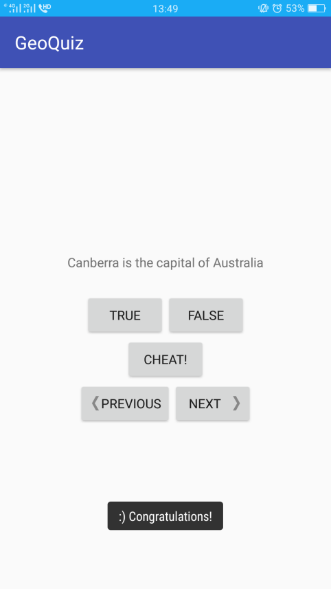

# GeoQuiz
My first attempt in Android application development.

A simple question answering app. The app will ask you a series of questions concerning geography. All you have to do is choosing 'True' or 'False'. 

You can also cheat if you don't know the answer!:wink:.

The app look like this:

